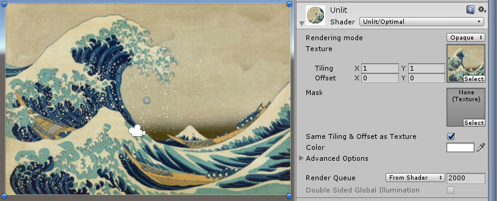
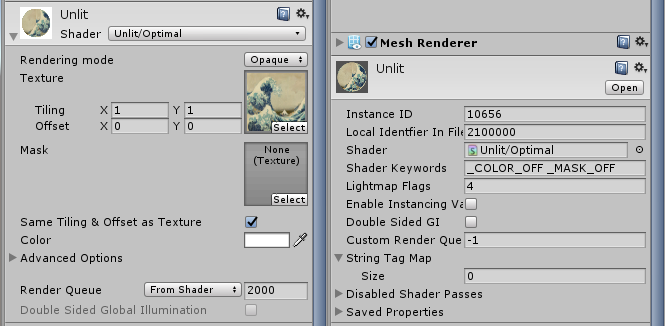
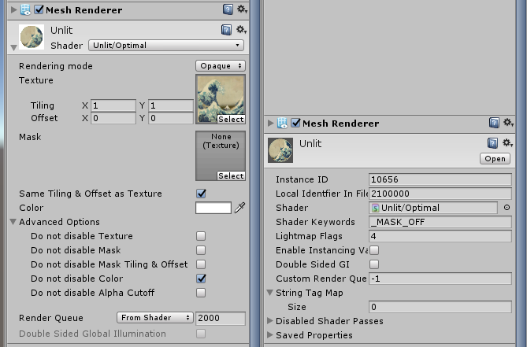

# Unity - Optimal Unlit Shader
An unlit shader for unity covering all the common use cases without any overhead for the features you don't use.

All the unused features are automatically disabled by the inspector so that the shader stays optimal. There is no longer a need to write multiple unlit shader variants for all you use cases (e.g. unlit with only a color, transparent unlit with color and a mask, unlit with texture and color, etc.)

 
*A simple material with only the main texture used. The shader code will not use the mask texture nor use the color.*

## Features
* Optional texture 
* Optional color
* Optional mask texture
* Optional separate mask texture tiling and offset
* Opaque / Cutout / Transparent rendering modes
* Unused features automatically disabled

## How it works

This shader has a custom inspector that will automatically enable keywords in order to disable unused features:
* `_TEXTURE_OFF`, when the main texture (`_MainTex`) is `null`, will disable the texture sampling
* `_MASK_OFF`, when the mask texture (`_Mask`) is `null`, will disable the mask texture sampling and the primary UV channel when used with `_TEXTURE_OFF`
* `_MASK_SCALE_OFFSET_OFF`, when the mask texture's tiling and offset are the same as the main texture's ones, will disable the mask secondary UV channel
* `_COLOR_OFF`, when the color (`_Color`) is white (1, 1, 1, 1), will disable the color multiplication

The "Rendering mode" dropdown allows to select between opaque, cutout and transparent rendering.

In cutout mode, the following keyword is also used:
* `_ALPHATEST_ON`, when the alpha cutoff parameter (`_Cutoff`) is more than zero, will enable alpha testing

 
*With only a main texture in this material, the mask and the color are disabled by the `_MASK_OFF` and `_COLOR_OFF` keywords*

## Use in animation or scripting

The shader features are only enabled or disabled by the inspector. If you modify the properties of a material using this shader by code or from an animation, the set of enabled features will not change.

If some features should be enabled (e.g. the color has changed and is no longer white), the material will not behave correctly (e.g. the material will stays white instead of being tinted).

To prevent this problem, you can use the toggles in the "Advanced Options" foldout. The selected features will not be disabled the material will behave correctly even when modified from outside the inspector.

 
*Unlike in the previous exemple, the color is not disabled by keyword*